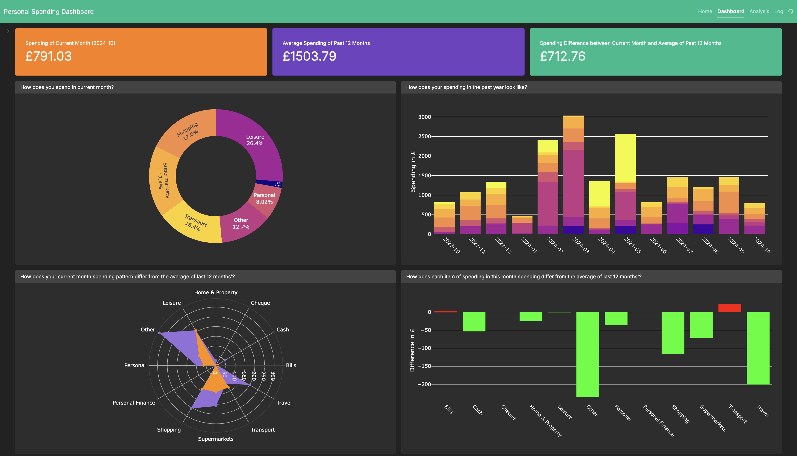

# Personal Spending Dashboard with R and Shiny

In this personal spending dashboard, you can see how your current month spending has been in various categories.

This dashboard also provides you valuable information about your spending, such as:

-   How does your current month's spending look like?
-   How does your yearly spending trend look like?
-   Does your spending pattern in current month differ from that of average of last 12 months'?
-   For each spending category, how does your current month's improve from average of last 12 months'?

Note that: - Your data will not be stored remotely! If you refresh the dashboard, all results are gone and you need to upload the same csv file for results again. - There is a specific format for uploaded csv file. Category's name is listed on the first column (with a header as 'category'), with spending for each month in the following columns. Each month's spending should have a relevant header. Please have a look at the example screenshot in the Homepage. - You can have as many categories as possible. - In the csv file, please have spending of the past 12 months and current month.
